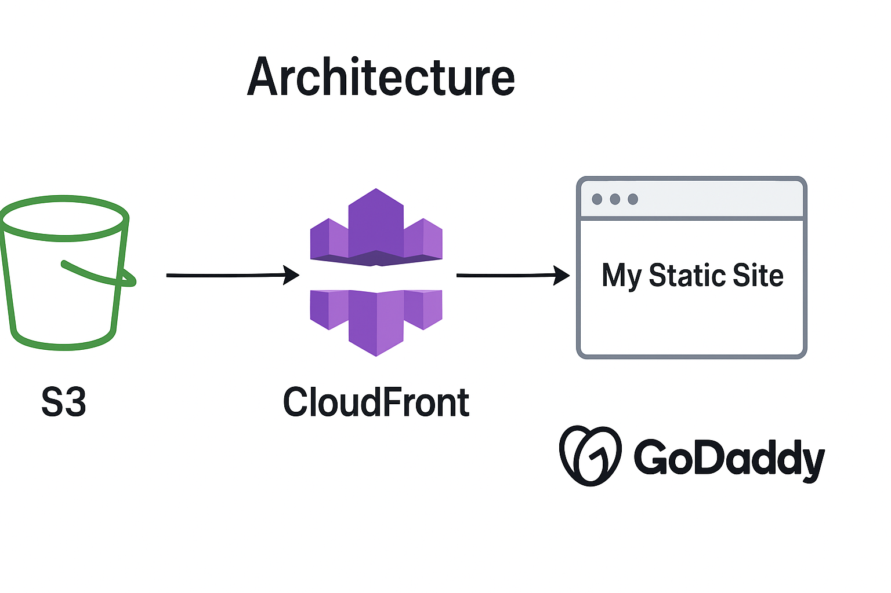
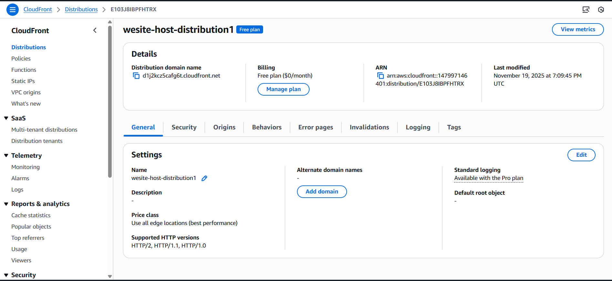
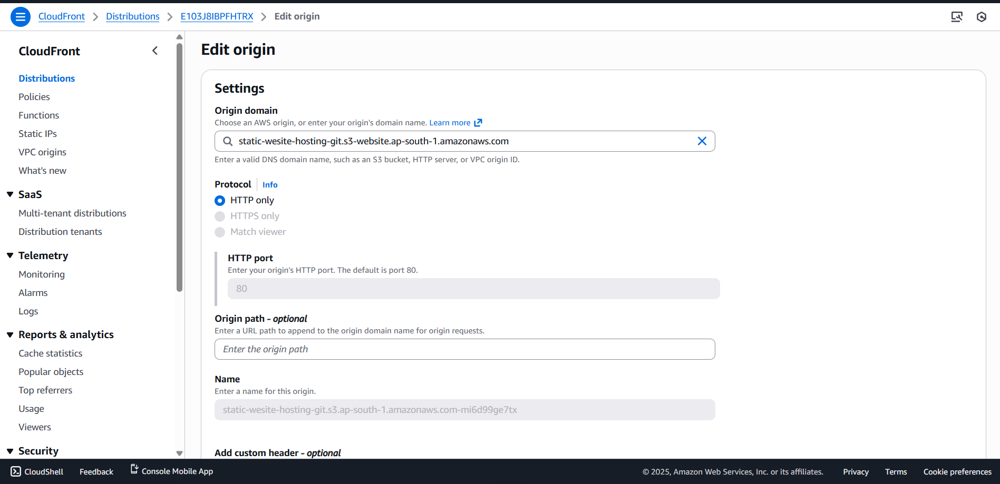
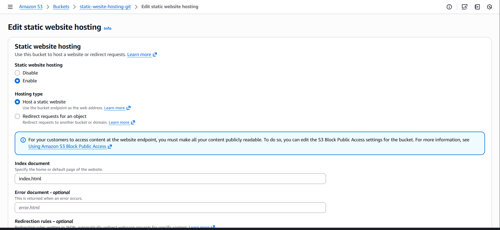
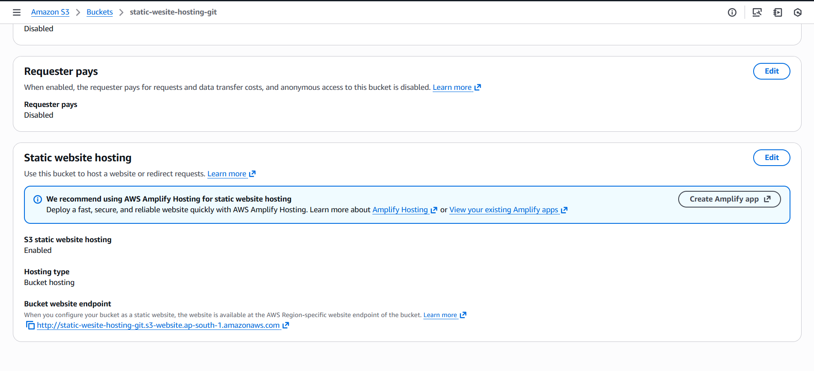
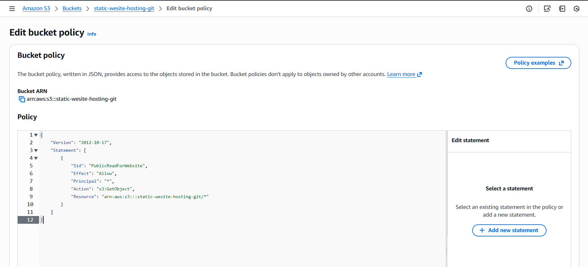
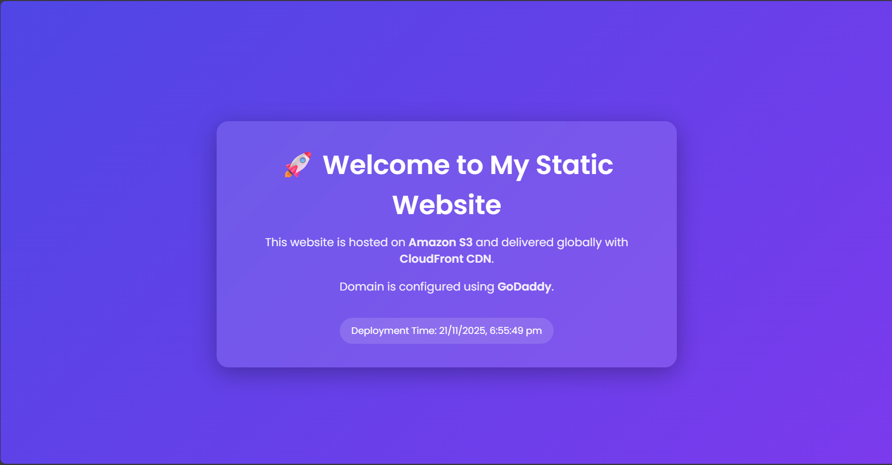

# Static Website Hosting using AWS S3, CloudFront, and GoDaddy

## 📌 Overview
This project demonstrates how to **host a static website** using **Amazon S3**, deliver it globally via **Amazon CloudFront**, and optionally connect it to a **custom domain purchased from GoDaddy**.  
The setup ensures high availability, low latency, and secure content delivery.

## 🧠 Concept
The core idea of this project is to create a **fully serverless static site hosting architecture** using AWS services.

## 🏗️ Architecture

```
User → DNS (GoDaddy) → CloudFront CDN → S3 Bucket → Static Website
```

### Architecture Image  


### CloudFront Distribution  
  


### S3 Bucket Objects  
  
  
  


### Final Hosted Website  


## 📄 index.html File
(HTML code omitted here for brevity—your original README will contain it.)

## 🚀 Features
- Serverless hosting  
- CDN caching  
- HTTPS with ACM  
- Custom domains  

## 📁 Tech Stack
- Amazon S3  
- Amazon CloudFront  
- GoDaddy  
- VSCode + GitHub  

## 🔧 Steps Involved
1. Create S3 bucket  
2. Enable hosting  
3. Configure policy  
4. Create CloudFront  
5. Configure DNS  
6. Deploy  

## 📝 Summary
This project showcases scalable static website hosting using AWS services.

### ✨ Author  
**Vishal Suresh Chavan**
